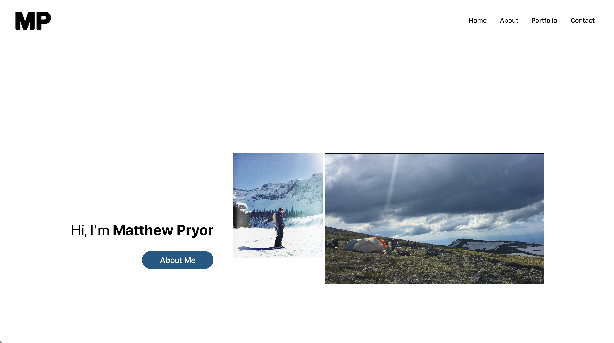

# [Matthew's Full-Stack Portfolio Website](https://powerful-chamber-65235.herokuapp.com/)

### Table of Contents

- [Description](#description)
- [Questions](#questions)
- [Application Image](#application-image)

## Description

I have created an updated personal website using React for the frontend framework. The website contains information about myself as well as projects I have worked on and ways to get in contact with me about work or collaborations.

## Questions

If you have any questions feel free to contact me here:

##### Github: [github.com/Pryority](https://github.com/Pryority)

##### Email: [matthewapryor@gmail.com](mailto:matthewapryor@gmail.com?subject=[GitHub])

## Application Image

